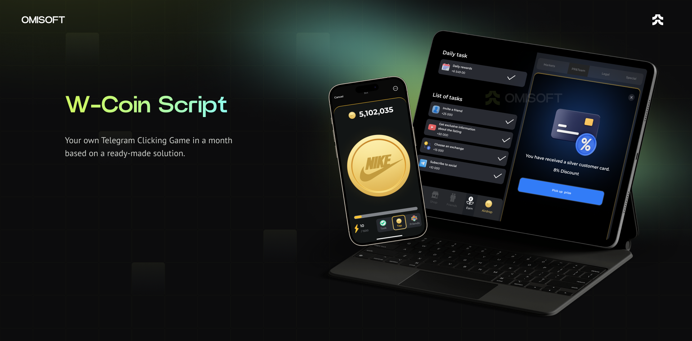

# W-Coin Script | Case Study & Custom Telegram Earn Game Solution

The **W-Coin Script** is a foundation for building your own Telegram-based Web3 Clicker Game. This repository highlights a proven approach to launching engaging games like NotCoin or Hamster Kombat with significantly reduced development costs and timelines.

**Want to launch your own W-Coin game?** We offer full implementation services so you can focus on marketing and scaling your community while we handle the technology.

## Why Choose This Solution?

The W-Coin Script helps you get started quickly and affordably in the Web3 gaming space. Our white-label solution combines speed, scalability, and customizability, ensuring your game launches seamlessly.

## Features Included in the Solution

### Core Functionality

- **Telegram Bot**: Fully integrated as a Telegram Mini App.  
- **User Authorization**: Secure login via Telegram.  
- **Mobile Optimization**: Responsive design for a flawless mobile experience.  
- **Admin Panel**: Efficiently manage game settings and monitor activity.  
- **Figma Design File**: Customizable UI/UX assets included.  
- **Localization**: Multilingual support for global audiences.  
- **DDoS Protection**: Secure platform against potential attacks.  
- **CI/CD Pipelines**: Automated deployments for updates and scalability.  
- **Referral Program**: Grow your community with incentivized referrals.  
- **Marketing Tools**: Includes Google Analytics and Microsoft Clarity for tracking performance.  

### Additional Features on Request

- Landing Page  
- Blog Integration  
- Social Media Integration  
- Crypto Deposit & Withdrawal  
- Mobile Application  
- Support Bot  
- Loot Boxes and Competitions  
- Marketing Bonuses (Join Bonus, Daily Bonus)  
- Custom features tailored to your business needs  

## Technology Overview

Built with modern, scalable technologies to deliver a seamless and robust experience.

  
Front End (App & Admin Panel)

  <ul>
      <li>React.js</li>
      <li>Redux Toolkit</li>
      <li>TypeScript</li>
      <li>Wagmi</li>
      <li>Jest (Unit Testing)</li>
  </ul>

  
Back End

  <ul>
      <li>Node.js</li>
      <li>Express.js</li>
      <li>TypeScript</li>
      <li>MongoDB & Mongoose</li>
      <li>Swagger (API Documentation)</li>
      <li>Jest & Supertest (Testing)</li>
  </ul>

  
Blockchain

  <ul>
      <li>Solidity (Smart Contracts for W-Coin Script)</li>
  </ul>

  
DevOps

  <ul>
      <li>Docker</li>
      <li>GitLab CI</li>
      <li>AWS Services</li>
  </ul>

## Pricing Packages

|                     | Basic Package      | NoFee Package | Special Offer  |
|---------------------|--------------------|---------------|----------------|
| Revenue Share       | 5%                 | 0%            | 0%             |
| Maintenance Cost    | Free               | $2,000/year   | Free           |
| Custom Design       | Logo & Colors Only | Fully Custom  | Fully Custom   |
| Admin Panel         | No                 | Yes           | Yes            |
| Initial Cost        | $10,000            | $15,000       | Contact Us     |

## Request a Demo

See the W-Coin Script in action! Contact us to explore how we can tailor this solution for your vision.

- <a href="https://telegram.me/omisoft" target="_blank">Message Us on Telegram</a>  
- <a href="https://omisoft.net/contact-us?utm_campaign=w-coin-clone&utm_medium=social&utm_source=github" target="_blank">Visit Our Website</a>  
- [Email Us Directly](mailto:hi@omisoft.net)  

## Frequently Asked Questions

  
What is the W-Coin Script?

  
The W-Coin Script is a white-label Telegram Clicker Game designed to help Web3 projects build engaged communities. Popular examples include NotCoin and Hamster Kombat games.

  
How long does it take to launch?

  
As a white-label solution, development and launch take less than a month—3-4 times faster than building from scratch.

  
What is included in the pricing packages?

  
The Basic and NoFee packages vary by customization level, maintenance costs, and revenue share. Contact us for details about our Special Offer tailored for large communities.

  
Can the product be hosted on our servers?

  
Yes, we provide CI/CD pipelines to ensure smooth updates and deployments on your infrastructure.

## Next Steps

Ready to transform the W-Coin Script into your own community-driven Telegram game? Contact us to begin your journey.  

Explore similar solutions:  

- [Hamster Kombat Like Game](https://omisoft.net/demo/hamster-kombat-clone-script)  
- [Crypto Lottery](https://omisoft.net/demo/crypto-lottery)  
- [ICO & IDO Launchpad](https://omisoft.net/demo/white-label-crypto-launchpad-development)  
